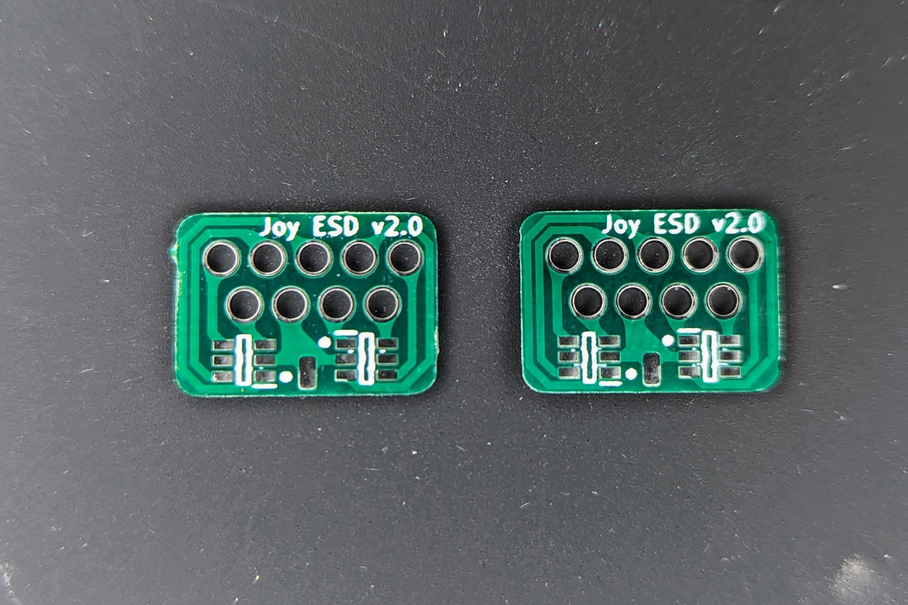
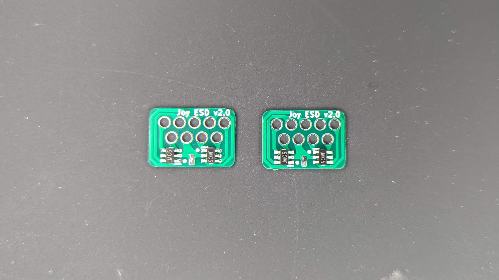
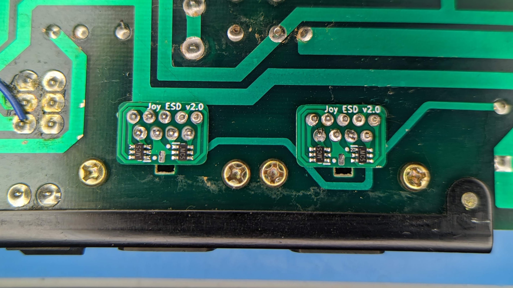

ESD Protection for Atari/Commodore style DB9 joystick ports.

I assembled mine with LiteON L13ESDL5V0C6-4 TVS diodes, but any SOT-23-6 package with a 5V standoff voltage should do the job.  I common base part number here is SRV05-4.

Here's a shot installed on a C64.

