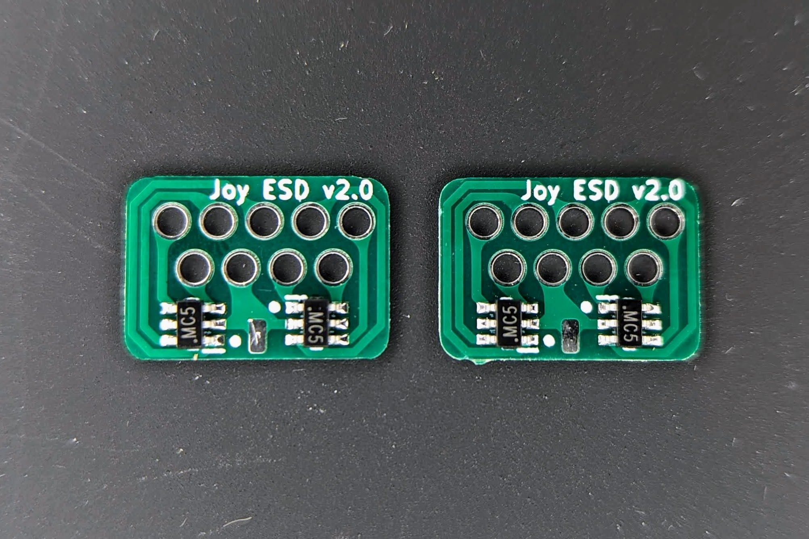

ESD Protection for Atari/Commodore style DB9 joystick ports. If manufacturing your own PCB's, use a thinner option like 0.6mm, instead of the default 1.6mm as you will be installing these on the back side of your computer's mainboard so you want to minimize the height here.

I assembled mine with LiteON L13ESDL5V0C6-4 TVS diodes, but any SOT-23-6 package with a 5V standoff voltage should do the job.  A common base part number here is SRV05-4.

Here's a shot installed on a C64.

Inspired by the work at https://www.hackup.net/2020/08/esd-protection-for-the-c64-control-ports/